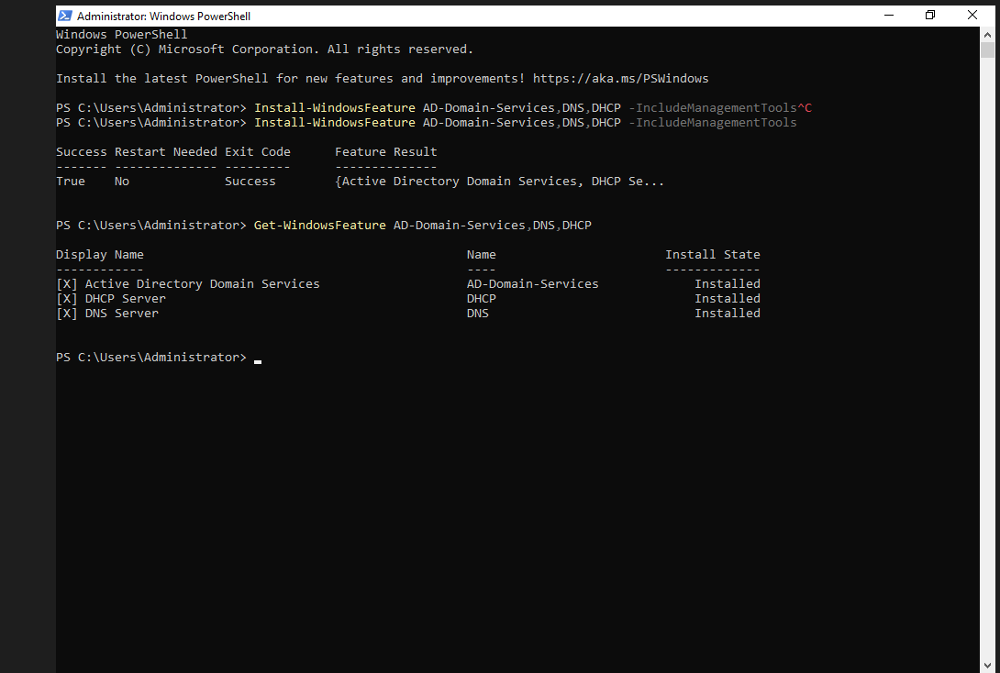
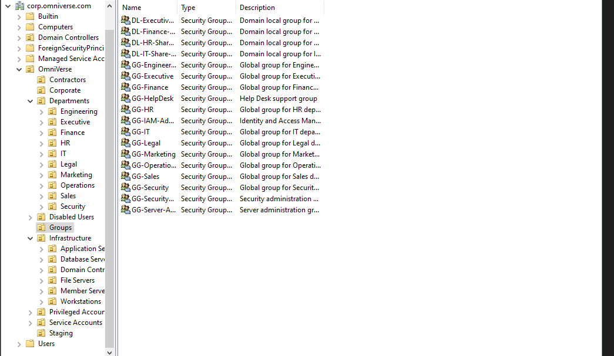

# Enterprise Active Directory Infrastructure (INFRA-001)

## Overview

This project documents the design, deployment, and automation of an enterprise Active Directory environment for **OmniVerse Enterprise** using Windows Server 2022.

The environment simulates a production enterprise by implementing organizational units, role-based access control (RBAC), DNS, DHCP, automated identity provisioning, service accounts, privileged administration, and PowerShell automation.

## Business Scenario

OmniVerse Enterprise needed a scalable on-premises identity foundation for a growing organization with multiple departments, privileged administrators, service accounts, and centralized network services.

The goal was to build an Active Directory environment that could support enterprise identity operations such as onboarding, department-based access, privileged account separation, DNS, DHCP, and future hybrid identity integration with Microsoft Entra ID.

---

## Environment

| Component | Value |
|------------|-------|
| Operating System | Windows Server 2022 |
| Domain | corp.omniverse.com |
| Domain Controller | OV-DC01 |
| DNS | Configured |
| DHCP | Configured |
| Enterprise Users | 2,000 |
| Security Groups | Department-Based RBAC |
| Service Accounts | 5 |
| Privileged Accounts | 5 |
| Automation | PowerShell |

---

## Installed Server Roles

Windows Server roles required to build the enterprise Active Directory infrastructure.

---

## Domain Controller Validation

The domain controller was validated after promotion to confirm that `OV-DC01` was operating as the Active Directory Domain Controller for `corp.omniverse.com`.

---

## Network Configuration

The server uses a dedicated internal enterprise LAN adapter for domain services and a separate NAT adapter for external connectivity.

---

## Enterprise OU Structure

The OU structure separates departments, infrastructure, service accounts, privileged accounts, contractors, disabled users, and staging objects.

---

## Department Structure

Department OUs were created to support clean identity organization, future Group Policy targeting, access control, and reporting.

---

## Enterprise Security Groups

Security groups follow a department-based RBAC model so access can be assigned by role instead of manually managed per user.

---

## HR Identity Source

The enterprise HR system exports employee information which is imported into Active Directory using PowerShell automation.

---

## Automated User Provisioning

PowerShell imports every employee, places them into the correct Organizational Unit, and assigns core identity attributes automatically.

---

## Department RBAC Assignment

Each user is automatically added to the appropriate department security group.

---

## Enterprise Users

The environment contains over 2,000 Active Directory user objects.

---

## Service Accounts

Enterprise service accounts are separated from employee identities.

---

## Privileged Administration

Dedicated privileged administrative accounts are separated from standard user identities.

---

## DHCP Infrastructure

### DHCP Console

### DHCP Scope

### DHCP Options

---

## Enterprise Security Groups Validation

---

## Enterprise Statistics

---

## Enterprise Administrative Accounts

---

## PowerShell Automation

### Included Scripts

- `01-Install-ADDS.ps1`
- `02-Network-Configuration.ps1`
- `03-Promote-Domain-Controller.ps1`
- `04-Build-OU-Structure.ps1`
- `05-Create-Security-Groups.ps1`
- `06-Generate-HR-CSV.ps1`
- `07-Import-HR-Users.ps1`
- `08-Assign-Department-Groups.ps1`
- `09-Create-Service-Accounts.ps1`
- `10-Create-Privileged-Accounts.ps1`
- `11-Configure-DHCP.ps1`

---

## What This Solves

This project solves several common enterprise identity problems:

- Manual user provisioning does not scale.
- Users need to be organized by department and role.
- Service accounts should not be mixed with employee accounts.
- Privileged admin accounts should be separated from standard accounts.
- DHCP and DNS should be centrally managed.
- Identity infrastructure should be documented and repeatable.

---

## Skills Demonstrated

- Windows Server Administration
- Active Directory Domain Services
- Organizational Unit Design
- DNS Administration
- DHCP Administration
- Role-Based Access Control
- Identity Lifecycle Management
- PowerShell Automation
- Enterprise Identity Provisioning
- Service Account Management
- Privileged Access Management
- Enterprise Documentation

---

## Project Outcome

- Deployed Windows Server 2022
- Installed AD DS, DNS, and DHCP roles
- Promoted `OV-DC01` as the enterprise Domain Controller
- Configured DNS and DHCP
- Built an enterprise OU hierarchy
- Created department-based security groups
- Generated a 2,000-user HR dataset
- Imported 2,000 enterprise users into Active Directory
- Automated department group assignment
- Created service accounts
- Created privileged administrator accounts
- Documented the environment for future hybrid identity projects

---

## Future Enhancements

This environment will be used as the foundation for future OmniVerse Enterprise projects:

- File Server and AGDLP permissions
- Group Policy Objects
- Microsoft Entra Connect
- Hybrid Identity Engineering
- Joiner-Mover-Leaver automation
- Conditional Access and Zero Trust
- Identity Governance and PIM
- Microsoft Sentinel

---

Created by **Keshawn Lynch**
