# Enterprise Active Directory Infrastructure (INFRA-001)

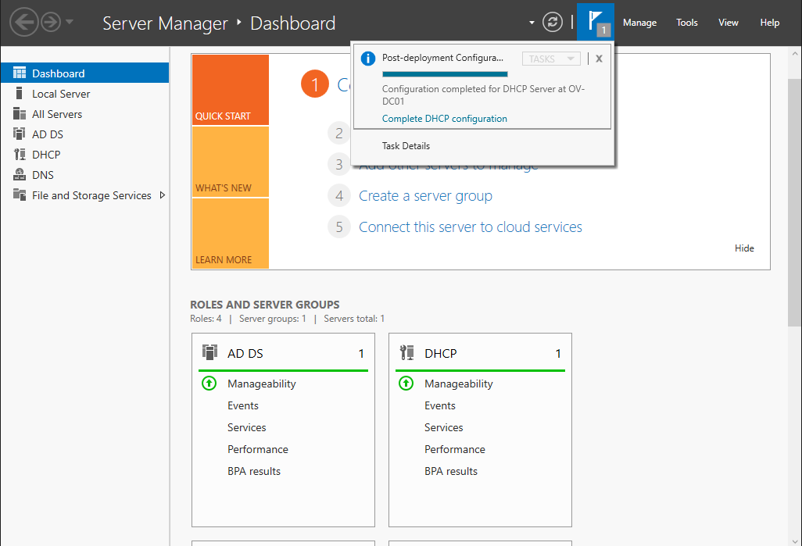

## Overview

This project documents the design, deployment, and automation of an enterprise Active Directory environment for **OmniVerse Enterprise** using Windows Server 2022.

The environment simulates a production enterprise by implementing organizational units, role-based access control (RBAC), DNS, DHCP, automated identity provisioning, service accounts, privileged administration, and PowerShell automation.

---

# Environment

| Component | Value |
|------------|-------|
| Operating System | Windows Server 2022 |
| Domain | corp.omniverse.com |
| Domain Controller | OV-DC01 |
| DNS | Configured |
| DHCP | Configured |
| Enterprise Users | 2,000 |
| Security Groups | Department-Based RBAC |
| Service Accounts | 5 |
| Privileged Accounts | 5 |
| Automation | PowerShell |

---

# Infrastructure Overview

## Domain Controller

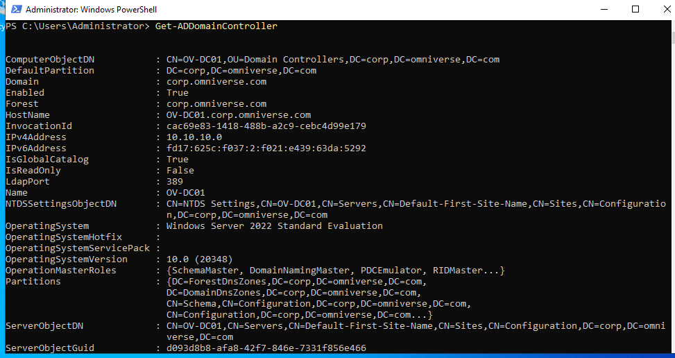

---

## Network Configuration

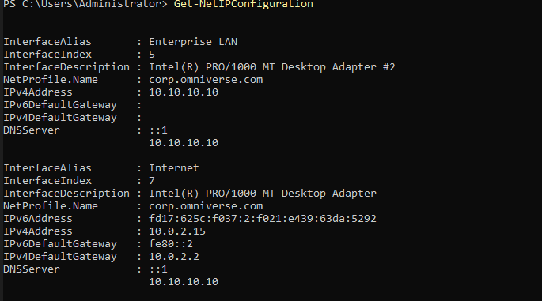

---

## Enterprise OU Structure

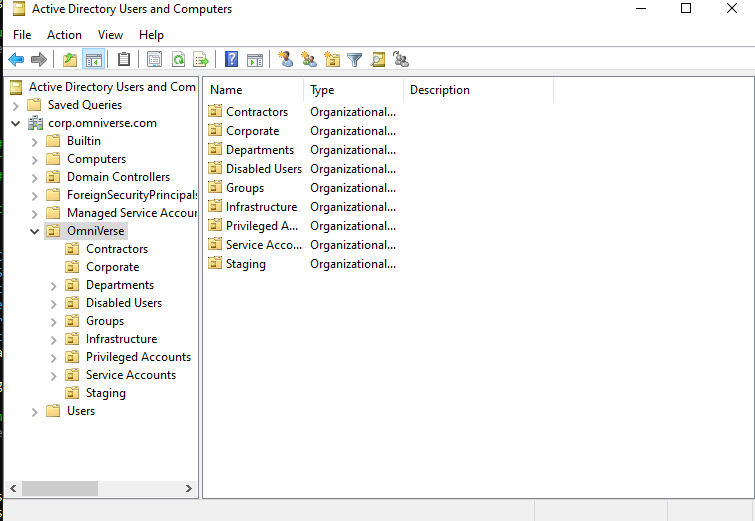

---

## Department Structure

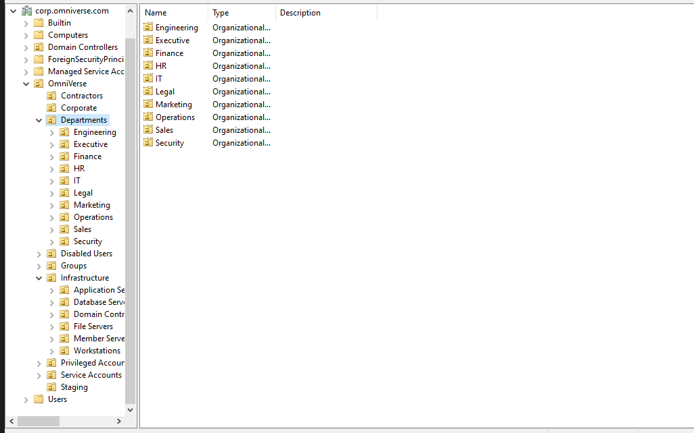

---

## Enterprise Security Groups

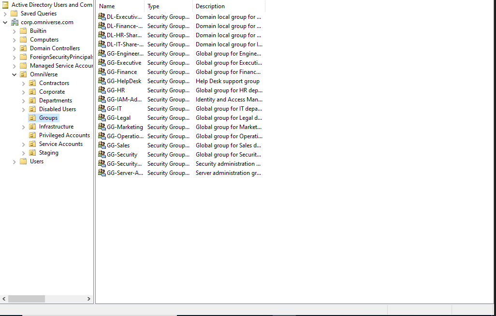

---

# HR Identity Source

The enterprise HR system exports employee information which is imported into Active Directory using PowerShell automation.

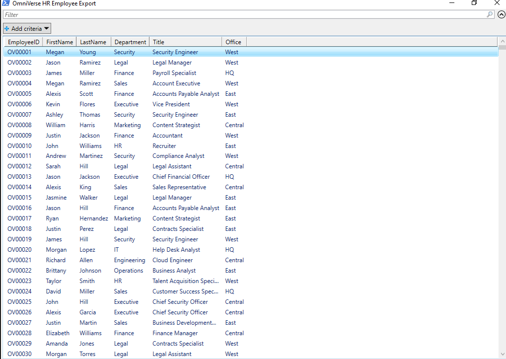

---

# Automated User Provisioning

PowerShell imports every employee, places them into the correct Organizational Unit, and assigns attributes automatically.

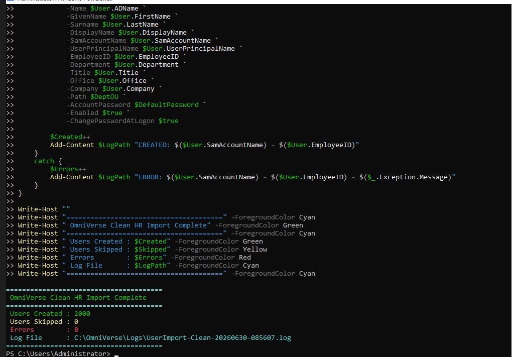

---

# Department RBAC Assignment

Each user is automatically added to the appropriate department security group.

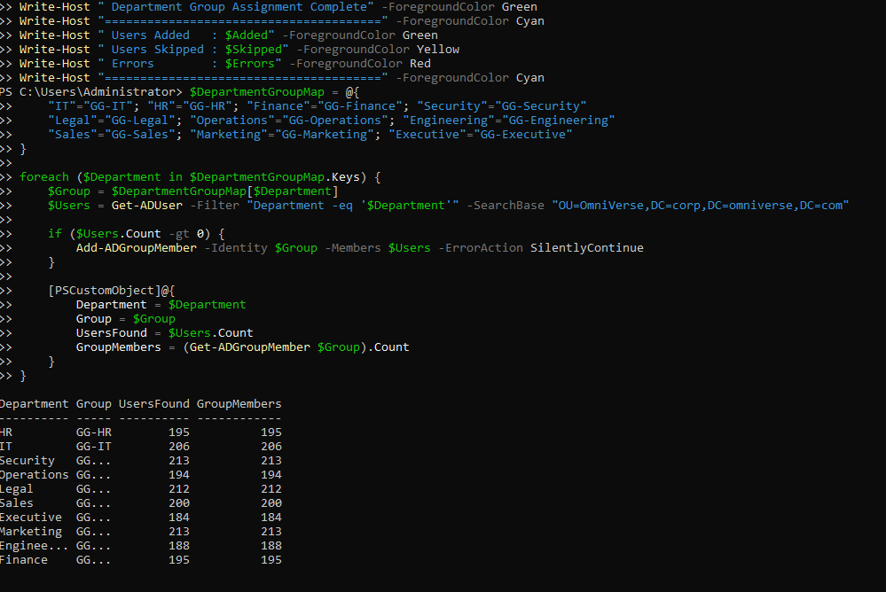

---

# Enterprise Users

The environment contains over 2,000 Active Directory user objects.

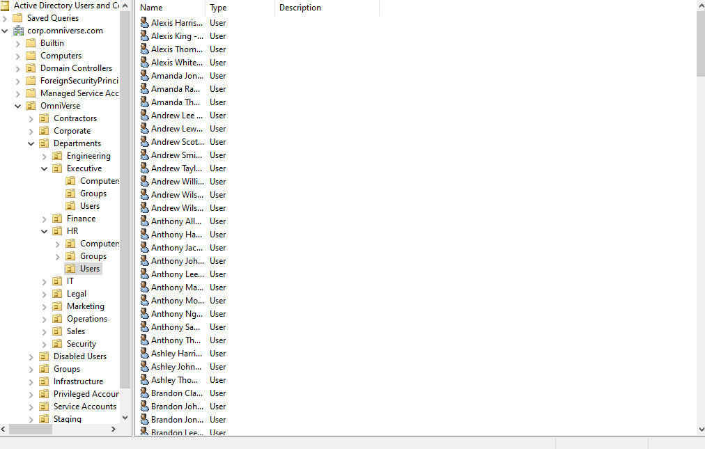

---

# Service Accounts

Enterprise service accounts are separated from employee identities.

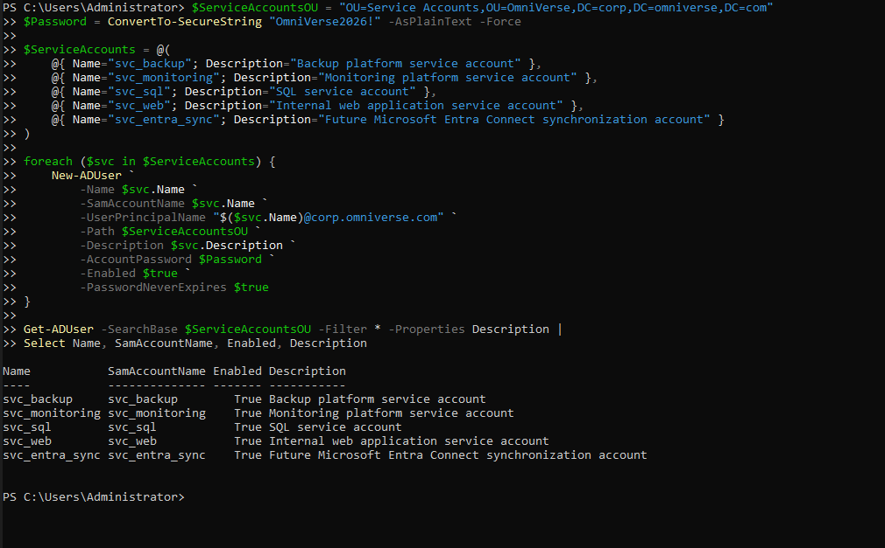

---

# Privileged Administration

Dedicated privileged administrative accounts are separated from standard user identities.

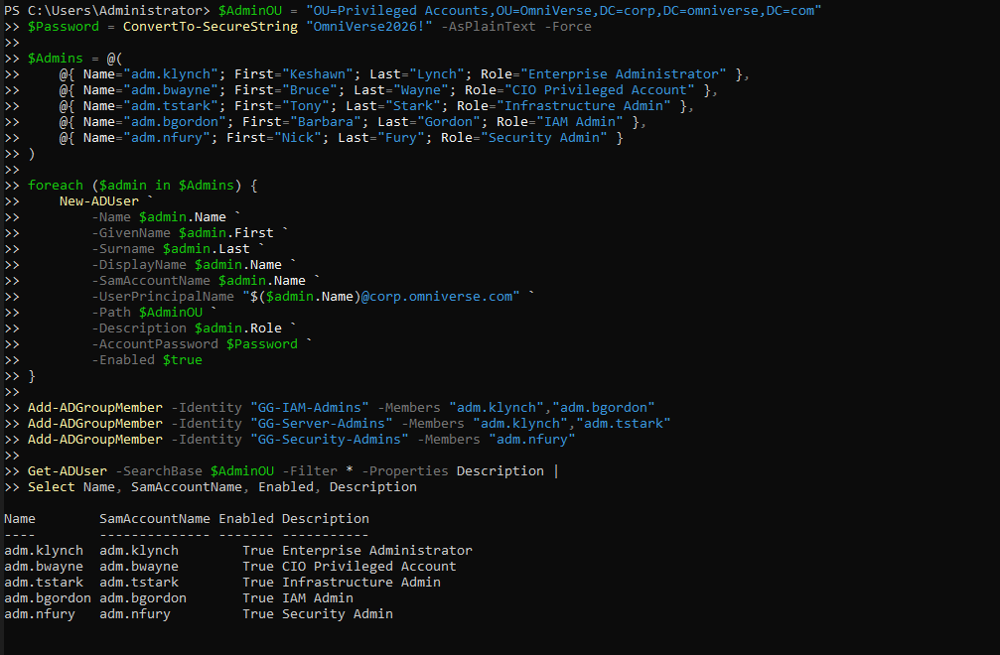

---

# DHCP Infrastructure

## DHCP Console

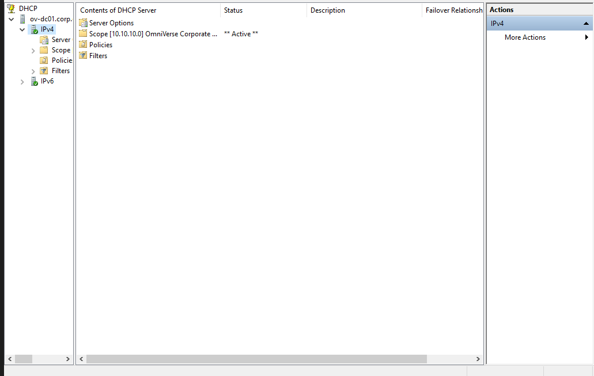

---

## DHCP Scope

---

## DHCP Configuration

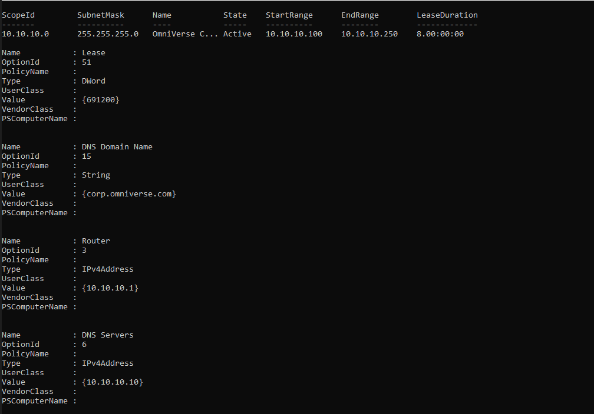

---

# Enterprise Statistics

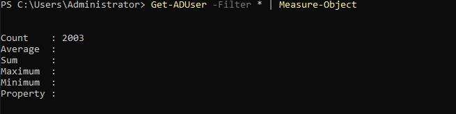

---

# Enterprise Administrative Accounts

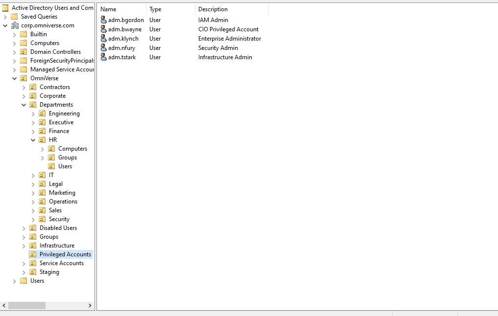

---

# PowerShell Automation

## Included Scripts

- 01-Install-ADDS.ps1
- 02-Network-Configuration.ps1
- 03-Promote-Domain-Controller.ps1
- 04-Build-OU-Structure.ps1
- 05-Create-Security-Groups.ps1
- 06-Generate-HR-CSV.ps1
- 07-Import-HR-Users.ps1
- 08-Assign-Department-Groups.ps1
- 09-Create-Service-Accounts.ps1
- 10-Create-Privileged-Accounts.ps1
- 11-Configure-DHCP.ps1

---

# Skills Demonstrated

- Windows Server Administration
- Active Directory Domain Services
- Organizational Unit Design
- DNS Administration
- DHCP Administration
- Role-Based Access Control (RBAC)
- Identity Lifecycle Management
- PowerShell Automation
- Enterprise Identity Provisioning
- Service Account Management
- Privileged Access Management
- Enterprise Documentation

---

# Project Outcome

✔ Windows Server 2022 deployed

✔ Active Directory Domain Services installed

✔ Enterprise Domain Controller promoted

✔ DNS configured

✔ DHCP configured

✔ Enterprise OU hierarchy created

✔ Department security groups created

✔ HR employee dataset generated

✔ 2,000 enterprise users imported

✔ RBAC group assignment automated

✔ Service accounts created

✔ Privileged administration implemented

✔ Enterprise infrastructure documented

---

Created by **Keshawn Lynch**
